# Knowledge Cards (KC) Performance Report

Local summary of completed `knowledge_cards` / `schema_card` runs vs matched
`icl` baselines in `results/`.

- **Model:** `gemini/gemini-3.6-flash` unless noted
- **Scope:** completed live runs only
- **Generated from:** local `results/<task>/live/` artifacts
- **Date:** 2026-08-04

## Headline

On every task with a matched ICL run, **KC ≥ ICL**. Task-tuned reflection
prompts help a lot on BSM, cohort, and sales; they do **not** help on
database exploration (default already stores the right kind of state).

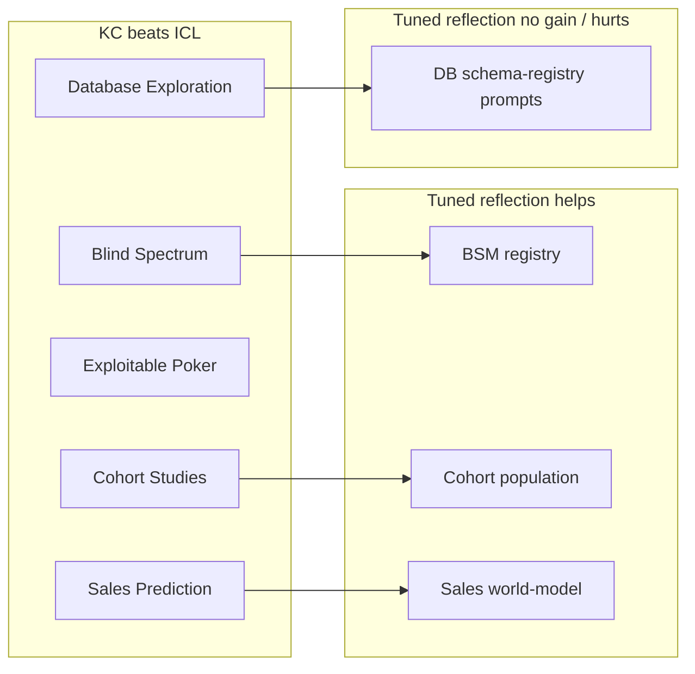

## Matched head-to-head

Primary comparison per task (fairest matched config). Poker uses the n=5
bakeoff; other tasks are n=1.

| Task | Setup | ICL | KC default | KC tuned / longer | Winner |
|------|-------|-----|------------|-------------------|--------|
| Blind Spectrum Monitoring | seed 42 · 90 scans | 0.217 | 0.220 | **0.499** | KC tuned |
| Database Exploration | seed 42 · 40 queries | 0.352 | **0.548** | 0.405 | KC default |
| Exploitable Poker | seed 42 · 40 hands · CS→FoF · n=5 | 0.963 | **1.453** | 1.180 | KC default |
| Sales Prediction | seed 123 · 12 instances | 0.551 | 0.616 | **0.774** | KC tuned |
| Cohort Studies | seed 42 · 20 studies | −0.045 | −0.038 | **0.070** | KC tuned |

```mermaid
xychart-beta
    title "Mean score by task (matched runs)"
    x-axis ["BSM", "Database", "Poker n=5", "Sales", "Cohort"]
    y-axis "Score" -0.1 --> 1.6
    bar [0.217, 0.352, 0.963, 0.551, -0.045]
    bar [0.220, 0.548, 1.453, 0.616, -0.038]
    bar [0.499, 0.405, 1.180, 0.774, 0.070]
```

Legend for the chart above: **series 1 = ICL**, **series 2 = KC default**,
**series 3 = KC tuned / longer**.

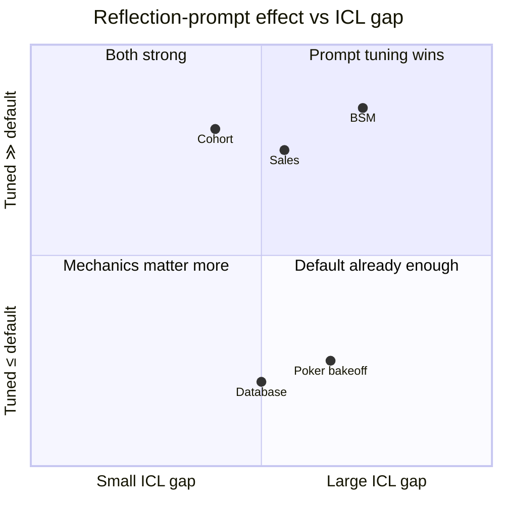

---

## Blind Spectrum Monitoring

**Setup:** seed 42 · 90 scans · default / mixed-grid lifecycle  
**Tuned prompt:** transmitter registry
(`configs/blind_spectrum_monitoring/prompts/transmitter_registry.txt`)

| System | Score | Baseline | 1st half | 2nd half | Learning Δ |
|--------|-------|----------|----------|----------|------------|
| ICL | 0.217 | 0.220 | 0.269 | 0.164 | **−0.106** |
| KC default | 0.220 | 0.220 | 0.218 | 0.221 | +0.004 |
| KC tuned | **0.499** | 0.220 | 0.435 | 0.563 | **+0.128** |

Default KC ≈ ICL (flat). Tuned registry prompt more than doubles IoU and
produces clear learning.

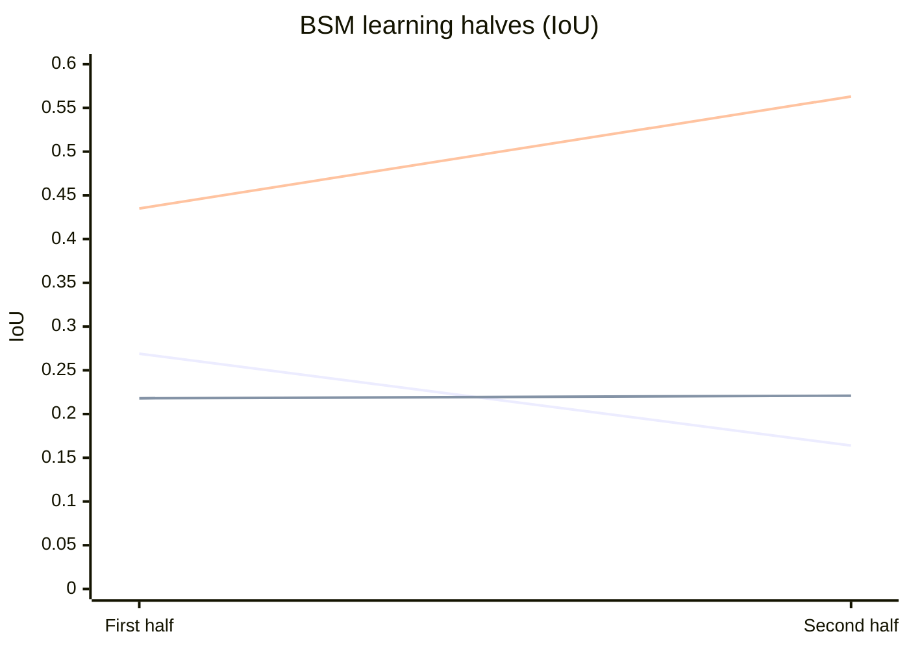

Series: ICL (declines), KC default (flat), KC tuned (improves).

**Run IDs**

- ICL: `2026-07-31T11-31-39.104846Z`
- KC default: `2026-07-31T10-47-25.488004Z`
- KC tuned: `2026-07-31T11-03-03.635198Z`

---

## Database Exploration

**Setup:** seed 42 · 40 queries · schema-drift default schedule  
**Committed tuned prompt:** `configs/database_exploration/prompts/schema_registry.txt`
(via `configs/database_exploration/database_exploration_knowledge_cards.json`) —
latest Aug 4 tuned run. Still **underperforms** the latest default KC.

### Latest Aug 4 A/B (primary)

| Run | Score | Acc | Avg Q | Baseline | Note |
|-----|-------|-----|-------|----------|------|
| **KC default** | **0.548** | 0.825 | 5.75 | 0.065 | empty reflection → code default |
| KC schema-rich tuned | 0.355 | 0.60 | 7.00 | 0.050 | encodings/joins/traps prompt |
| KC schema-registry tuned | 0.405 | 0.675 | 5.98 | 0.065 | committed `schema_registry.txt` |

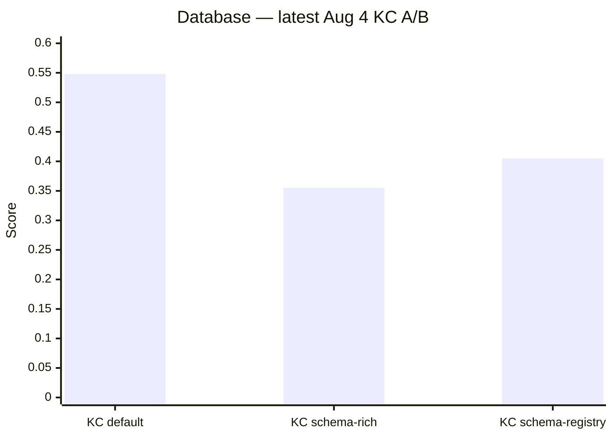

**Run IDs (Aug 4)**

- KC default: `2026-08-04T08-51-33.871033Z`
- KC schema-rich: `2026-08-04T08-52-00.684588Z`
- KC schema-registry: `2026-08-04T09-26-55.061197Z`

### All completed gemini-3.6-flash runs

| Run | Score | Accuracy | Avg queries | Note |
|-----|-------|----------|-------------|------|
| ICL | 0.352 | 0.45 | 2.48 | dialogue continuity |
| SC no drop-stale | 0.303 | 0.70 | 9.03 | keep cards across drift |
| **SC drop-on-drift** | **0.562** | 0.80 | 5.53 | best overall card run |
| SC trust+confidence | 0.508 | 0.75 | 5.88 | mechanics tweak |
| SC longer reflection | 0.552 | 0.80 | 5.50 | ≈ drop-on-drift |
| KC default (Jul 31) | 0.490 | 0.825 | 6.78 | earlier default |
| KC longer prompt (Jul 31) | 0.483 | 0.775 | 6.85 | one-off longer schema cards |
| **KC default (Aug 4)** | **0.548** | **0.825** | 5.75 | latest default |
| KC schema-rich (Aug 4) | 0.355 | 0.60 | 7.00 | tuned; worse than ICL≈tie |
| KC schema-registry (Aug 4) | 0.405 | 0.675 | 5.98 | committed tuned; still &lt; default |

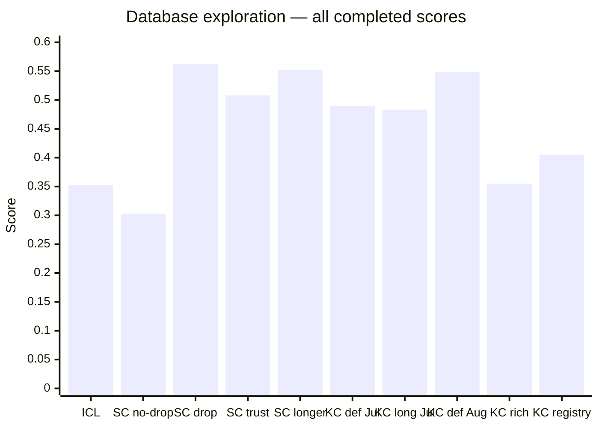

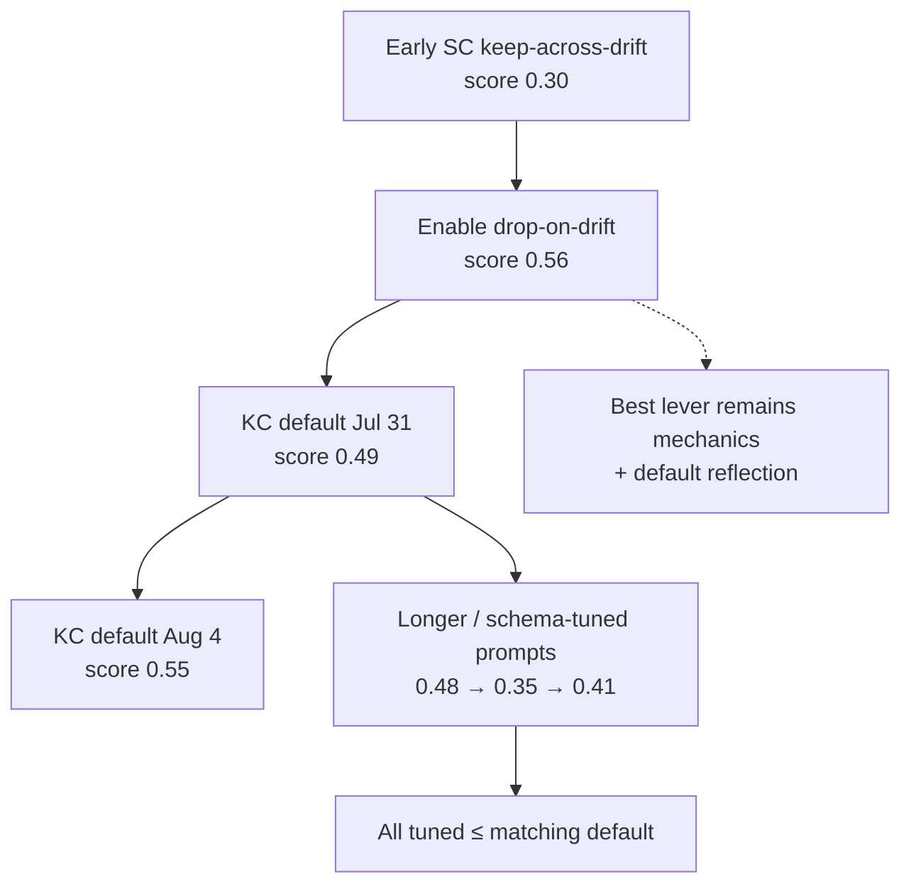

**Takeaway:** Latest default KC (0.548) clearly beats ICL (0.352) and both
new tuned prompts (0.355 / 0.405). Prompt specialization on DB still does not
help; keep the generic default.

---

## Exploitable Poker

### Bakeoff (primary) — `calling_station_then_fit_or_fold` · 40 hands · n=5

| System | Mean | Std | Baseline | Per-run scores |
|--------|------|-----|----------|----------------|
| ICL | 0.963 | 0.35 | 1.503 | 0.79, 0.95, 0.78, 1.56, 0.74 |
| KC default | **1.453** | 0.61 | 1.100 | 1.03, 0.95, 2.23, 2.01, 1.05 |
| KC tuned | 1.180 | **0.18** | 1.115 | 1.21, 0.89, 1.34, 1.16, 1.30 |

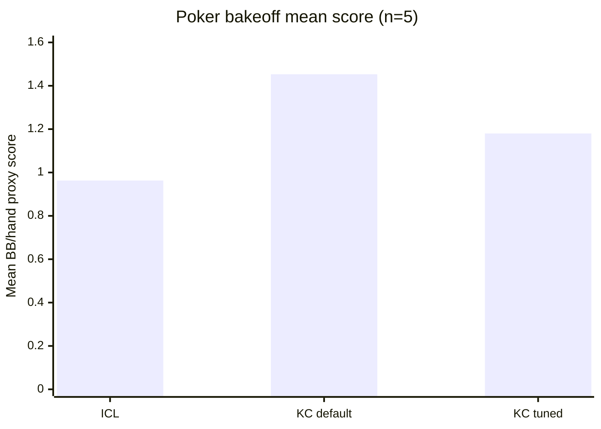

Default KC wins on mean; tuned is stabler (lower variance).

### Early default schedule — 120 hands · n=1

| System | Score | Baseline |
|--------|-------|----------|
| ICL | 0.763 | 0.470 |
| KC default | **1.229** | 0.567 |
| KC tuned | 1.217 | 0.757 |

Same direction as the bakeoff: both KC variants beat ICL.

**Run IDs (bakeoff)**

- ICL: `2026-07-31T09-11-34.669384Z`
- KC default: `2026-07-31T09-03-13.865258Z`
- KC tuned: `2026-07-31T09-16-45.015559Z`

---

## Sales Prediction

**Setup:** seed 123 · 12 instances · default schedule  
**Tuned prompt:** demand world-model
(`configs/sales_prediction/sp_lifecycle_knowledge_cards.json`)

| System | Score | Baseline |
|--------|-------|----------|
| ICL | 0.551 | 0.506 |
| KC default | 0.616 | 0.497 |
| KC tuned | **0.774** | 0.469 |

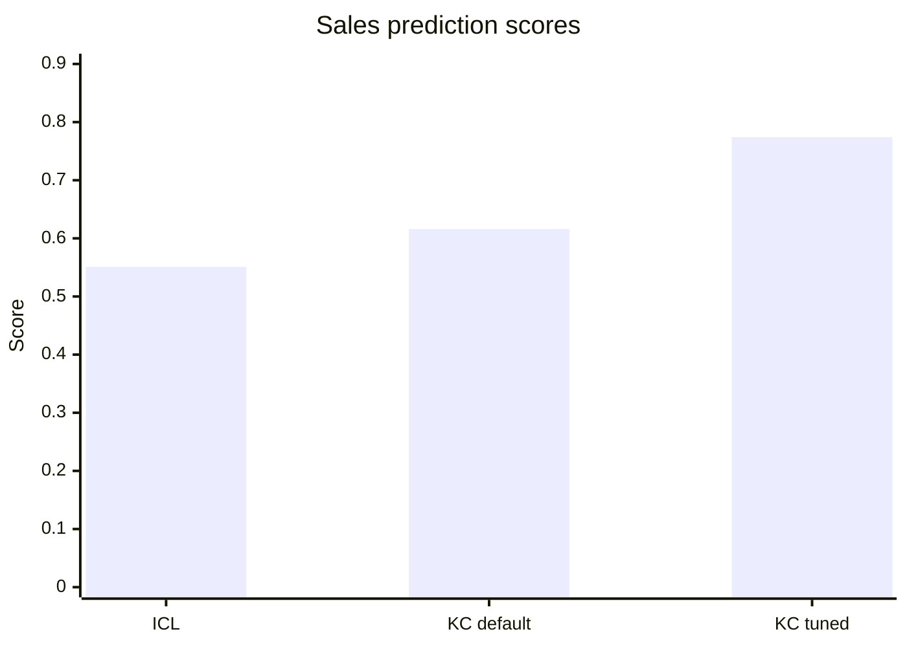

Default already beats ICL; tuned world-model prompt adds another clear step.

**Run IDs**

- ICL: `2026-08-04T08-13-58.032763Z`
- KC default: `2026-08-04T07-56-59.952056Z`
- KC tuned: `2026-08-04T08-11-57.874049Z`

---

## Cohort Studies

**Setup:** seed 42 · 20 studies · default schedule · `repeat_instructions=true`  
**Tuned prompt:** anti-freeze population registry
(`configs/cohort_studies/prompts/population_registry.txt`)

| System | Score | 1st half | 2nd half | Interactions |
|--------|-------|----------|----------|--------------|
| ICL | −0.045 | −0.009 | −0.081 | 69 |
| KC default | −0.038 | −0.062 | −0.014 | 81 |
| KC tuned v1 | +0.043 | −0.006 | +0.092 | 48 |
| **KC tuned v2** | **+0.070** | **+0.018** | **+0.122** | **80** |

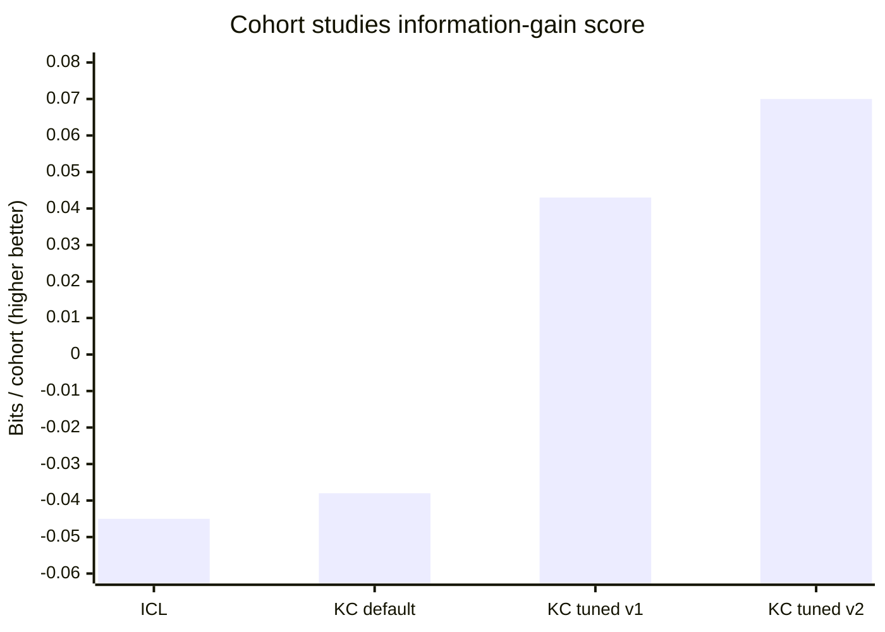

Default KC ≈ ICL (both negative). Tuned v1 flips positive but freezes early.
Anti-freeze v2 is best so far: positive from half 1, stronger late stages,
more exploration (80 vs 48 interactions).

**Run IDs**

- ICL: `2026-08-04T08-27-54.056850Z`
- KC default: `2026-07-31T12-13-59.463011Z`
- KC tuned v1: `2026-07-31T12-31-56.986592Z`
- KC tuned v2: `2026-08-04T10-04-57.219336Z` (learning run OK; baseline flaked 19/20)

---

## When to tune the reflection prompt

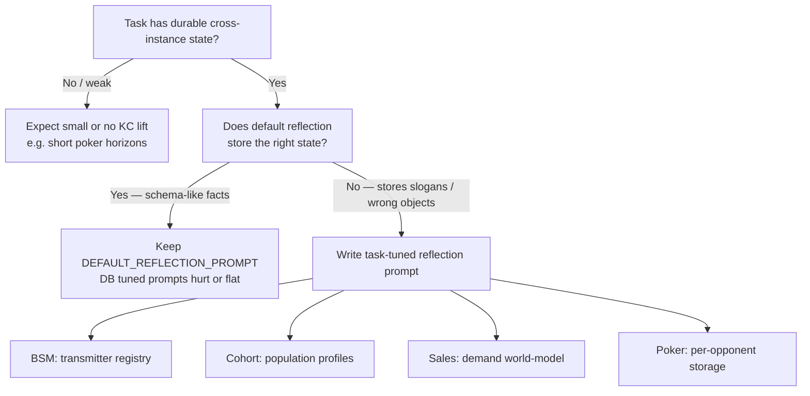

Committed tuned configs today:

| Task | Config / prompt source |
|------|------------------------|
| Blind Spectrum Monitoring | `configs/blind_spectrum_monitoring/bsm_mixed_grid_knowledge_cards.json` |
| Cohort Studies | `configs/cohort_studies/cohort_studies_knowledge_cards.json` |
| Exploitable Poker | `configs/exploitable_poker/exploitable_poker_knowledge_cards.json` |
| Sales Prediction | `configs/sales_prediction/sp_lifecycle_knowledge_cards.json` |
| Database Exploration | `configs/database_exploration/...` exists, but **prefer default** (tuned underperforms) |

---

## Caveats

- Most comparisons are **n=1** (poker bakeoff is n=5). Treat as early
  signals, not locked leaderboard numbers.
- All local comparisons use **gemini-3.6-flash**. Stronger-model ICL numbers
  elsewhere are not same-model evidence against KC.
- Incomplete / failed live manifests and single-opponent poker schedules are
  omitted from the primary tables.
- Schema_card runs are included under database exploration as the predecessor
  of knowledge_cards.

## Sources

- Live manifests / run JSON under `results/<task>/live/`
- Design notes: `src/systems/knowledge_cards/notes.md`
- Interactive canvas: workspace canvases `icl-vs-kc-by-task.canvas.tsx`
